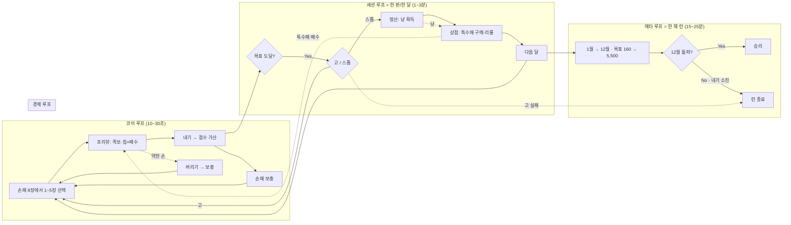

# 화투로 — 고스톱: 무한의 판 · 컨셉

> 프로젝트 1회 작성 문서. 개별 기획 단위는 `design/<NN>_<slug>/`에서 이 문서를 참조한다.
> **작성 기준**: `index.html` (v5 · 밀치기 고) 구현 실물 · 2026-07-28

---

## 1. 한 줄 정의

한국 화투 48장으로 족보를 맞춰 목표 점수를 넘기는 **1인용 Balatro라이크 로그라이크 덱빌더**.

| 항목 | 값 |
|---|---|
| 장르 | 로그라이크 덱빌더 / 카드 / 싱글 |
| 시점 | 2D 정면 테이블 뷰 (탑다운 화투판) |
| 플랫폼 | 웹 (데스크톱 + 모바일 브라우저), 빌드·서버 없음 |
| 한 런 | 1월 → 12월, 12판 |
| 세션 길이 | `[가정]` 1런 15~25분 (실측 없음 · §04_balance 앵커 `T_s`) |
| 배포 | GitHub Pages — https://sleeeppy.github.io/hwatro/ |
| 타겟 | 화투 룰을 아는 한국 이용자 + Balatro류 덱빌더 이용자 |

**플레이 판타지**
손패를 짜고 → 한 방 족보로 목표를 넘기고 → 욕심내어 **고**를 외치거나 **스톱**으로 도망치고 → 냥으로 특수패를 사 빌드를 키운다.

**차용 출처**

| 가져온 것 | 출처 |
|---|---|
| 족보 · 고/스톱 · 박 · 정산의 긴장 | 고스톱 |
| 칩 × 배수 스코어링, 블라인드 커브, 조커 상점 | Balatro |
| 한 해를 도는 서사 · 계절감 | 화투 월 체계 |

---

## 2. 세계관

밤새 이어지는 **화투판 그 자체**가 무대다. 청록 모포(felt) 위에 청동 프레임을 두른 한 상(床)이 있고, 플레이어는 한 해 열두 달을 한 판씩 건너간다. 달이 바뀌면 판 위의 계절이 바뀌고(이달의 패), 해가 뜨고 지며(밤일낮장), 3·6·9·12월 환절기에는 **박**이 끼어 판을 비튼다.

- 등장인물은 사실상 없다 — 상대는 "판" 자체다.
- 유일한 인격체는 조력자 **춘향**(현재 구현 비활성 · §06_policy 이탈 #1).
- 톤: 화려한 판타지가 아니라 **밤 화투판의 끈적한 긴장**. 청록 모포 + 청동 + 금박.

---

## 3. 코어 루프

- **수익 루프 없음** — 결제·광고·과금 접점이 존재하지 않는다. `M(수익 기여)` 축은 전 시스템 0점.
- **메타 진행 없음** — 런 간 영구 성장(해금·업그레이드)이 없다. 저장/불러오기도 없어 새로고침 = 런 소실.

---

## 4. 아트 디렉션

### 무드 키워드 (5개 — 모든 프롬프트를 이걸로 앵커한다)

`청록 모포` / `청동 프레임` / `밤 화투판` / `금박 활자` / `한 방의 타격감`

### 컬러 팔레트 (실측 — `index.html:root`)

| 역할 | 토큰 | Hex | 용도 |
|---|---|---|---|
| 모포 | `--felt` | `#1a4a2e` | 테이블 바탕 |
| 모포 그늘 | `--felt-dark` | `#113020` | 하단 비네트 |
| 배경 베이스 | — | `#142e1f` | `Assets/Background.webp` 위 합성 |
| 패널 | `--panel` | `rgba(10,22,14,.78)` | 사이드·모달 패널 |
| 청동 프레임 | `--frame` | `#c4a25a` | 화면 외곽·패널 테두리 |
| 청동 그늘 | `--frame-deep` | `#8a6e3a` | 프레임 음영 |
| 금 | `--gold` | `#d4af37` | 냥·강조 수치 |
| 금(연) | `--gold-soft` | `#e8cd7a` | 목표·라벨 |
| 칩 | `--chip-blue` | `#60a5fa` | 프리뷰 칩 수치 |
| 배수 | `--mult-red` | `#f87171` | 프리뷰 배수 수치 |
| 홍 | `--red` | `#c0392b` | 홍단·경고 |
| 먹 | `--ink` | `#1f2937` | 카드 텍스트 |
| 본문 | — | `#f1f5f9` | 텍스트 |

`[확인필요]` 대비비 검증 미실시. `--gold #d4af37` on `--panel`은 육안상 통과로 보이나 4.5:1 실측이 없다 → `07_acceptance` 항목으로 이관.

### 형태 언어

- 화면 외곽에 **청동 1px 테두리 + 모서리 ㄱ자 장식**(`body::before/::after`) — 판을 "상(床)"으로 액자화.
- 패널 모서리 반경 8px, 버튼 8px. 카드는 실물 화투 비율의 세로 직사각.
- 대칭은 프레임에만. 카드 아트는 원본 화투 그대로(비대칭).

### 재질 · 라이팅

젖은 모포, 낡은 청동, 금박 인쇄. 카드 일러스트는 `?cardTune=1` 튜너로 **밝기/채도/세피아를 일괄 보정**해 48장의 톤을 맞춘다(현재 값은 `localStorage:hwatro_card_tune`).

### 타이포

| 용도 | 폰트 | 파일 |
|---|---|---|
| 오버레이 제목·족보 배너 | `BaigeTianxing` | `Assets/Fonts/zihun-baige-tianxing.woff2` |
| 오버레이 숫자 | `SSRock` | `Assets/Fonts/SSRockRegular.woff2` |
| 본문 UI | 시스템 (`Malgun Gothic` / `Apple SD Gothic Neo`) | — |

### UI 톤

**다이제틱 지향** — 화면 자체가 화투상. 단 가독성이 장식보다 우선이며, 수치(점수·배수·냥)는 항상 최고 대비로 띄운다.

### 등급 표현 규칙

| 등급 | 한글 | 출현 | 가격대 | 표현 |
|---|---|---|---|---|
| `common` | 커먼 | 55% | 3~4냥 | 기본 테두리 |
| `rare` | 레어 | 28% | 6~7냥 | 청색 계열 라벨 |
| `epic` | 에픽 | 13% | 9~10냥 | 보라 계열 라벨 |
| `legendary` | 레전더리 | 4% | 13~15냥 | 금색 라벨 |

`[확인필요]` 등급별 프레임/파티클 에셋 없음 — 현재 CSS 클래스(`.r-common` 등) 색상만. 데이터 키 `rarity_style` 미도입.

### 금지 목록

- 화투 원본 도상을 벗어나는 재해석 일러스트 (48장 정체성 훼손)
- 형광·네온 채도, 순수 검정/백색
- 아이콘 내부의 텍스트
- 서양 카드 문법(수트·숫자)으로의 치환

---

## 5. 기술 기본값 (실측 — 스킬 기본값과 다름)

| 항목 | 이 프로젝트 |
|---|---|
| 구조 | **단일 `index.html`** (6,749줄). `js/`·`css/`·번들러 없음 |
| 외부 의존 | **0** — CDN·프레임워크·폰트 CDN 전부 금지 |
| 로직/렌더 분리 | `==== ENGINE START ==== ~ ==== ENGINE END ====` 마커 구간이 **DOM 없는 순수 로직**. 테스트가 이 구간을 문자열로 추출해 Node에서 실행 |
| 렌더 | 단방향 `render()` 전체 재그리기 + 인라인 `onclick` |
| 게임 루프 | 없음 (이벤트 구동). 연출만 `async/await` + `setTimeout` |
| 테스트 | `node test/test-game.mjs` — 엔진 단위 테스트 + 그리디 봇 600런 |
| 배포 | `main` 푸시 → GitHub Actions → GitHub Pages |
| 저장 | `localStorage`는 **튜토리얼 진행·표시 설정만**. 런 상태 저장 없음 |

> 스킬 기본값(`js/` 분할 폴더 구조)과 충돌하지만, **기존 구조가 정책이다**(POL-ARC-01). 분할은 승인 대상.

---

## 6. 성능 예산

| 항목 | 상한 | 현황 · 지키는 법 |
|---|---|---|
| 초기 로딩 | ≤ 3초 (4G) | 48장 webp + 오버레이 4장 + 폰트 2종 프리로드. 진행률 UI(`#boot-load`) 존재, 최소 0.55초 유지 |
| 프레임 | 60fps | DOM/CSS 애니메이션만. 최악 장면 = 고 캐스케이드(파편 스폰) |
| 이미지 총량 | `[확인필요]` 미측정 | 48 + 4 + 1 = 53장 webp |
| 폰트 | 2웨이트 | woff2, `font-display:swap` |
| 사운드 | SFX 10종 · BGM 0 | mp3, WebAudio 프리워밍 |
| 콘솔 에러 | 0건 | 리소스 실패는 전부 try/catch 흡수 |

---

## 7. 정책 대장 (Phase 0 수집 결과)

> 수집 순서: `CLAUDE.md` → `AGENTS.md` → `HANDOFF.md` → `docs/기획서.md` → **코드 상수 실측** → `README.md`.
> `관습`은 **추론**이며 문서로 확정된 적 없다.

### 아키텍처 · 코드

| POL-ID | 정책 문장 | 근거 | 강도 |
|---|---|---|---|
| POL-ARC-01 | 게임 전체는 단일 `index.html`. 외부 리소스·빌드·서버 금지 | `CLAUDE.md` · `AGENTS.md:8` | HARD |
| POL-ARC-02 | `ENGINE START/END` 마커 사이는 DOM 접근 금지 (테스트가 추출 실행) | `CLAUDE.md` · `index.html:2522/2883` | HARD |
| POL-ARC-03 | 엔진 수정 시 `node test/test-game.mjs` 필수 실행 | `CLAUDE.md` | HARD |
| POL-ARC-04 | 카드 선택 상태는 배열 인덱스가 아닌 **uid**로 저장 | `CLAUDE.md` · `state.selected` | HARD |
| POL-ARC-05 | 족보 판정과 core 선정은 `detectHandInfo` 한 곳에서만 | `CLAUDE.md` · `index.html:2667` | HARD |
| POL-ARC-06 | 경제 사이드이펙트(광팔이 지급·통계)는 `playSelected()`에서만. 프리뷰는 순수 드라이런 | `CLAUDE.md` · `index.html:3435` | HARD |
| POL-ARC-07 | 연쇄 고는 `checkAfterPlay()` 재진입으로 처리 (재귀·모달 중첩 금지) | `CLAUDE.md` | HARD |

### 스코어링 · 규칙

| POL-ID | 정책 문장 | 근거 | 강도 |
|---|---|---|---|
| POL-SCR-01 | 족보 기본칩 없음. 점수 = (코어 카드칩) × 배수 + flat | `CLAUDE.md` · `computeScore` | HARD |
| POL-SCR-02 | 카드 칩 적용 순서: 기본칩 → 이달의 패 ×2 → 밤낮 +2 → 박 0 | `CLAUDE.md` · `cardChip` | HARD |
| POL-SCR-03 | `Math.floor`는 최종 점수에서 1회만 | `CLAUDE.md` · `index.html:2855` | HARD |
| POL-SCR-04 | core는 족보 구성에 **필요한 장수만** (열끗셋·띠셋 3장, 초과분 flat) | `CLAUDE.md` · `topByBaseChip` | HARD |
| POL-SCR-05 | +칩 특수패는 배수 밖(flat), +배수 → ×배수 순으로 적용 | `computeScore:2849-2851` | HARD |
| POL-GO-01 | 고는 무제한. n고 문턱 = `ceil(base × (1+0.6n))`, 보너스 `n × m`(m=월) | `CLAUDE.md` (사용자 확정) | HARD |
| POL-GO-02 | 고는 밀치기 — 이미 넘은 문턱 전부 소급, 선언 목표는 항상 현재 점수 초과 | `CLAUDE.md` · `goLevelReached` | HARD |
| POL-GO-03 | 고 선언 1회당 내기 +1 (밀친 단계 수와 무관) | `CLAUDE.md` · `chooseGo:3596` | HARD |
| POL-RND-01 | 판 시작 리셋 제외: money · jokers · mitjangChips · usedBosses · makgeolli · stats | `CLAUDE.md` · `startRound` | HARD |
| POL-BOS-01 | 안개 뒷면은 새로 뽑힌 카드만 지정. 공개된 카드는 다시 안 뒤집힘 | `CLAUDE.md` · `applyAngaeFaceDown` | HARD |

### 밸런스 · 디자인 방향

| POL-ID | 정책 문장 | 근거 | 강도 |
|---|---|---|---|
| POL-BAL-01 | 밸런스는 빡빡하게 — 난이도 조정 시 하향보다 **상향 우선** | `CLAUDE.md` (사용자 확정) | SOFT |
| POL-BAL-02 | 목표 커브(160→5,500) 기준: 무조커 3월 벽 ~15%, 봇 승률 ~0% | `CLAUDE.md` · 시뮬 실측 | SOFT |
| POL-BAL-03 | 고 캡을 되돌리지 않는다 (무제한 유지) | `CLAUDE.md` (사용자 확정) | HARD |
| POL-NAM-01 | 새 시스템·특수패 네이밍은 고스톱/한국 전통 용어에서 | `CLAUDE.md` · `AGENTS.md` | SOFT |
| POL-CHR-01 | 캐릭터·연출 요소 환영 (표정/대사 있는 인터랙션) | `CLAUDE.md` | SOFT |
| POL-CHR-02 | 춘향은 **한 상호작용 = 한 효과**. 만능 조력자·상시 훈수로 되돌리지 않음 | `docs/기획서.md §11-B` | SOFT |

### 관습 (추론 — 문서로 확정된 적 없음)

| POL-ID | 관찰된 규칙 | 근거 (관찰) | 강도 |
|---|---|---|---|
| POL-ECO-01 | 시작 자금 4냥 · 특수패 소지 상한 5 · 상점 슬롯 3 | `state.money=4` · `buyJoker:3729` · `genOffers` 루프 3 | 관습 |
| POL-ECO-02 | 특수패 판매가 = 지불액의 절반(내림) | `sellJoker:3757` | 관습 |
| POL-ECO-03 | 리롤 2냥 시작, 1회마다 +1냥 (판 넘어가면 2냥 리셋) | `openShop:3682` · `reroll:3766` | 관습 |
| POL-ECO-04 | 이자는 **정산 진입 시점 보유금** 기준, 5냥당 1냥, 상한 5냥 | `settle:3669` | 관습 |
| POL-ECO-05 | 재화는 `냥` 단일. 보유 상한 없음 | 전 코드 | 관습 |
| POL-SHP-01 | 상점 오퍼는 **미보유 특수패만**, 중복 없음 | `genOffers:3705` | 관습 |
| POL-BOS-02 | 박은 런 내 중복 없음(`usedBosses`), 3월은 약한 박 3종에서만 | `openShop:3688` | 관습 |
| POL-UX-01 | 불가능한 액션은 **버튼 비활성 + 흔들림(`flashActions`)** 으로 알린다. 팝업 없음 | `buyJoker` · `nextRound` | 관습 |
| POL-UX-02 | 모달은 스택하지 않는다 — `state.screen` 하나가 활성 모달 하나를 결정 | `renderModal` | 관습 |
| POL-UX-03 | 연출 중에는 입력을 잠근다 (`state.juicing` / `dealing`) | `playSelected:3406` | 관습 |
| POL-DAT-01 | 튜토리얼·표시 설정만 `localStorage` 영속화. 런 상태는 저장하지 않는다 | `hwatro_*` 키 6종 | 관습 |
| POL-DAT-02 | 시드는 URL(`?seed=`)로만 고정. 미지정 시 매 런 난수 | `resetRun:3797` | 관습 |

---

## 8. 확장 후보 (스펙에서 분리 — 이번 문서 범위 밖)

| 후보 | 한 줄 | 출처 |
|---|---|---|
| 멍석(바닥패) | 판 시작 시 바닥 공개, 같은 달 붙여 총점 × 배수 | `HANDOFF.md §B` · `docs/기획서.md §11-A` |
| 춘향 개편 | 만능 조력자 ❌ → 단일 킥 소모 인터랙션(막걸리=정보 / 소주=리소스) | `docs/기획서.md §11-B` |
| 보너스피 | 덱 성장 소모품 | `CLAUDE.md` |
| 족보책 | 족보 영구 강화 | `CLAUDE.md` |
| 뒤집기 찬스 | 도박성 이벤트 | `CLAUDE.md` |
| 나가리 | 실패 시 목표 이월 | `CLAUDE.md` |
| 저장/불러오기 | 런 이어하기 | `CLAUDE.md` |
| 화투 패 강화 | Balatro 플레잉카드식 개별 카드 강화 | `docs/기획서.md 결론` |
