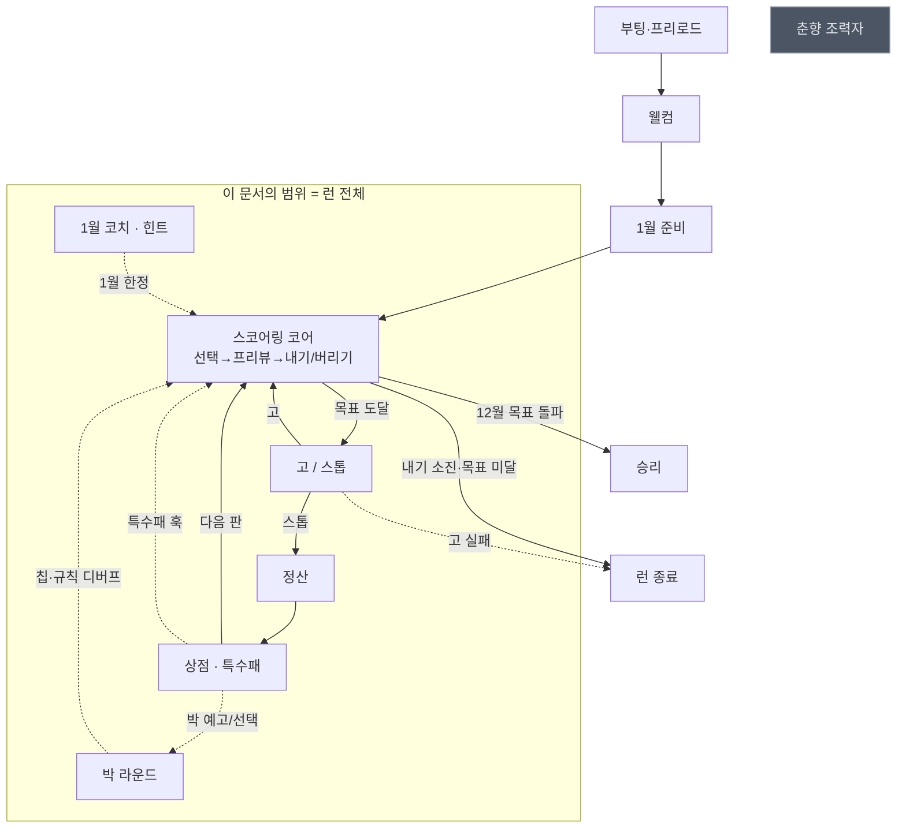

# 전체 흐름 속 좌표 & 무게감

**대상**: 현행 구현(v5 · 밀치기 고) 전체
**모드**: REVISE (as-built 재문서화)

---

## 1. 루프 지도

`00_concept.md §3`의 루프 지도 위에, **이번 문서가 커버하는 범위**를 표시한다.



**춘향은 회색** — 코드는 전부 살아 있으나 `CHUNHYANG_ENABLED = false`로 잠겨 있다 (`index.html:2887`). 문서(`README.md`·`docs/기획서.md`)는 활성으로 기술 중 → `06_policy.md` 이탈 #1.

## 2. 접속 관계표

| 항목 | 내용 |
|---|---|
| 진입 경로 | 브라우저에서 `index.html` 열기 (URL 파라미터: `?seed=N` · `?goPreview=1` · `?cardTune=1`) |
| 이탈 경로 | 런 종료(`gameover`) / 승리(`victory`) → `restart()` → 1월부터 새 런. 브라우저 닫기 = 소실 |
| 선행 시스템 | 없음 (메타 진행·계정·저장 없음) |
| 후행 시스템 | 없음 |
| 주고받는 재화 | **입력**: 없음 / **내부 순환**: 점수 → 냥 → 특수패 → 배수 → 점수 / **출력**: 없음 |
| 끊겼을 때 | 어떤 부분이 멈춰도 런이 통째로 멈춘다 — 단일 루프 게임이라 대체 경로가 없다 |

## 3. 무게감 판정 — 매크로 (런 전체)

| 축 | 점수 | 근거 |
|---|---|---|
| F 접촉 빈도 | 5 | 게임 = 이 루프 하나. 세션당 수십 회 |
| C 루프 결속도 | 5 | 코어·세션·메타 루프가 전부 여기 |
| P 성장 기여 | 5 | 유일한 파워 성장 경로(특수패·고 스노우볼) |
| M 수익 기여 | 0 | 결제 접점 없음 |
| R 실패 리스크 | 5 | 목표 커브·고 계수·특수패 배수 중 하나만 틀려도 런 전체 붕괴 |
| S 대체 불가성 | 5 | 대체 수단 없음 |

```
Weight = 0.25(5) + 0.25(5) + 0.15(5) + 0.15(0) + 0.10(5) + 0.10(5)
       = 1.25 + 1.25 + 0.75 + 0 + 0.5 + 0.5 = 4.25  →  Tier S
```

> `M=0`은 이 프로젝트에 수익 루프가 없어서다. 수익 축을 제외하고 정규화하면 `5.00 / Tier S`.

## 4. 무게감 판정 — 서브시스템 (문서 밀도 배분)

각 서브시스템의 무게가 **이 기획서에서 얼마나 깊게 쓸지**를 결정한다.

| 서브시스템 | F | C | P | M | R | S | Weight | Tier | 이 문서에서의 밀도 |
|---|---|---|---|---|---|---|---|---|---|
| 스코어링 (족보·칩·배수) | 5 | 5 | 4 | 0 | 5 | 5 | **4.10** | S | 전 수식·전 테이블·손검산 |
| 고 / 스톱 | 4 | 5 | 3 | 0 | 5 | 5 | **3.70** | A | 수식 + 문턱 전표 + 연출 사양 |
| 상점 · 특수패 22종 | 3 | 4 | 5 | 0 | 4 | 4 | **3.30** | A | 전 종 표 + 훅 문법 + 가격 검산 |
| 박 라운드 6종 | 2 | 3 | 2 | 0 | 4 | 3 | **2.25** | B | 표 + 상호작용 주의점 |
| 경제 (냥·정산·이자) | 3 | 4 | 3 | 0 | 5 | 3 | **3.00** | A | Faucet/Sink 표 + 잉여율 |
| 1월 코치 · 힌트 | 1 | 2 | 0 | 0 | 2 | 2 | **1.35** | C | 스텝 표 + 진입 조건만 |
| 연출 (주스·고 캐스케이드) | 5 | 2 | 0 | 0 | 2 | 3 | **2.65** | B | 시퀀스 표 + 입력 잠금 규칙 |
| 춘향 (비활성) | 0 | 0 | 0 | 0 | 1 | 1 | **0.20** | C | 현황·잔존 코드 목록만 |

**해석**

- 문서 분량의 절반 이상이 **스코어링 + 고/스톱 + 상점**에 가야 한다.
- 연출(2.65)이 박(2.25)보다 무겁다 — 접촉 빈도가 압도적이기 때문. 실제로 코드 라인 수도 연출이 박의 30배다(`index.html:5434-6749`).
- 춘향(0.20)은 표 한 줄로 끝낸다. 되살릴지 말지가 결정 대상이지 기획 대상이 아니다.

## 5. Tier S 산출 깊이 — 이번 문서에 적용

| 산출물 | Tier S 요구 | 이번 문서의 이행 |
|---|---|---|
| 문서 | 7종 분리 | ✅ `01`~`07` |
| 와이어프레임 | 전 화면 + 전 상태 | ✅ 화면 10종 + 상태 매트릭스 (`02_flow`) |
| 예외 케이스 | 8개 이상 + 팝업 사양 | ✅ 14종 (`02_flow §3`) — **단 as-built는 대부분 팝업 없음**이 결론 |
| 데이터 스키마 | 전 필드 + 검증 규칙 | ✅ (`03_data`) — **리허설 결과 = 스키마 결함** |
| 추가 리허설 | 3종 | ✅ 특수패 / 족보 / 박 (`03_data §6`) |
| 밸런스 | 수식 + 표 + 몬테카를로 + 민감도 | ✅ (`04_balance`) — 몬테카를로는 봇 600런 실측 사용 |
| 아트 | 전수 대장 + 프롬프트 + 예산 | ✅ (`05_art`) |
| 정책 | 전 영역 대조 | ✅ (`06_policy`) |
| 완료 기준 | 15개 이상 | ✅ 32개 (`07_acceptance`) |

## 6. 요소 위계 (마이크로)

### SCR-PLAY-01 · 본판

| 위계 | 요소 | 근거 |
|---|---|---|
| **1차** | `[내기]` 버튼 | 이 화면에 온 유일한 목적. 점수를 만드는 유일한 행위 |
| 2차 | 손패 카드(선택) · `[버리기]` · 프리뷰 패널 | 1차에 도달하기 위한 경유. 프리뷰가 선택을 되먹임 |
| 3차 | 📖 족보표 · ✨ 튜토리얼 · 🏷 라벨 토글 · `hint` 토글 | 조회·설정 |
| 배경 | 점수 게이지 · 이달의 패 · 박 배너 · 내기 기록 · 덱 카운트 · 특수패 바 · 보유 냥 · seed | 정보 표시 |

> `[내기]`와 `[버리기]`가 같은 크기·같은 위치에 나란히 있다 → **1차가 2개로 보인다**. 위계 규칙 위반이며, 실제로 초심자가 버리기를 내기로 착각하는 리스크가 있다. `06_policy` 신설 제안 #2.

### SCR-SHOP-01 · 상점

| 위계 | 요소 | 근거 |
|---|---|---|
| **1차** | 오퍼 카드의 `[N냥에 구매]` | 상점에 온 목적 |
| 2차 | `[다음 판으로 →]` · `[🔄 리롤]` · 박 후보 선택 버튼 | 이탈·재추첨·필수 선택 |
| 3차 | 보유 특수패 `[+N냥]` 판매 버튼 · 슬롯 탭(설명) | 정리·조회 |
| 배경 | 보유 냥 · 슬롯 5칸 · 다음 달 목표 예고 | 정보 |

> 12월 직전 상점에서는 **박 후보 선택이 사실상 1차**가 된다(선택 전 `[다음 판으로]` 비활성). 조건부 위계 승격이며 `02_flow` 상태 매트릭스에 명시.

### SCR-GOSTOP-01 · 고/스톱

| 위계 | 요소 | 근거 |
|---|---|---|
| **1차** | `[고]` — 게임의 정체성이자 유일한 도박 결정 | 연출 예산의 대부분이 여기 |
| 1차(동급) | `[스톱]` | ⚠️ 의도적 2택. 위계 규칙의 명시적 예외 — **선택 자체가 콘텐츠**라 우열을 두지 않는다 |
| 배경 | 현재 점수/목표 · 내기 수 · 남은 패 수 | 판단 근거 |

## 7. 재평가 트리거

아래 중 하나라도 발생하면 Phase 1로 되돌아온다. **기존 점수표는 지우지 말고 아래에 덧붙인다.**

- 멍석(바닥패) 도입 → 스코어링 R축·연출 무게가 재산정됨
- 춘향 재활성 → 0.20에서 재판정
- 저장/불러오기 도입 → 메타 루프가 생겨 F·C 재산정
- 수익 모델 도입 → `M` 축이 0에서 벗어남
- 3월 벽 통과율이 설계값(~15%)에서 ±10%p 이상 이탈
