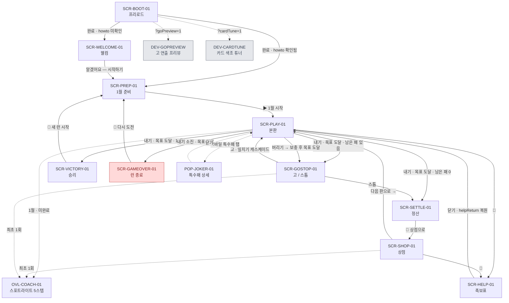

# 화면 플로우 & 와이어프레임

**대상**: 현행 구현(v5) 전체 · Tier S
**디바이스**: 데스크톱 1280×800 기준 / 모바일 반응형 (`max-width:720px`에서 버튼 라벨 축약, 터치 UI 분기 `isTouchUI()`)

> 이 게임은 SPA 단일 페이지다. "화면"은 라우트가 아니라 **`state.screen` 값 + 모달 오버레이**로 구현된다.
> `state.screen` 실제 값: `welcome | prep | play | gostop | settle | shop | gameover | victory | help`

---

## 1. 스크린맵



### 검증

| 규칙 | 결과 |
|---|---|
| 고아 화면 없음 (진입 ≥1) | ✅ 전 화면 |
| 막다른 골목 없음 (이탈 ≥1) | ✅ 전 화면 |
| 1차 목적까지 3탭 이내 | ✅ 부팅 → 웰컴 → 준비 → 본판 = 2탭. 재방문 시 1탭 |
| 되돌아가기 상태 보존 | ⚠️ 부분 — 도움말만 `state.helpReturn`으로 복원. **런 전체는 새로고침 시 소실**(저장 없음) |
| 모달 스택 금지 | ✅ `state.screen` 단일값이 활성 모달 하나를 결정 (POL-UX-02) |

**누락된 경로**: `SCR-SETTLE-01`에서 `SCR-HELP-01`로 못 간다(도움말 버튼은 사이드바에만 있고 정산은 전체 모달). 의도된 제약이 아니라 구조상 사각지대 → `07_acceptance` 항목.

---

## 2. 화면 카드

### SCR-PLAY-01 · 본판

- **목적**: 손패 8장에서 1~5장을 골라 내기/버리기로 목표 점수를 넘긴다
- **디바이스**: 데스크톱 좌측 사이드 + 우측 테이블 2단 / 모바일 1단 세로 스택
- **진입점**: `SCR-PREP-01 [▶ 1월 시작]` · `SCR-SHOP-01 [다음 판으로]` · `SCR-GOSTOP-01 [고]` · `SCR-HELP-01 [닫기]`
- **이탈점**: 고/스톱 · 정산 · 승리 · 런 종료 · 도움말
- **백스택**: 없음. 되돌아가기 개념 자체가 없다 (한 방향 진행)
- **요소 위계**: 1차 = `[내기]` / 2차 = 손패·`[버리기]`·프리뷰 / 3차 = 📖✨🏷·hint / 배경 = 게이지·박 배너·기록

```
┌─ SCR-PLAY-01 ─────────────────────────────────────────────────────────┐
│ 화투로            ┌──┬──┬──┬──┬──┐        💰{{state.money}}냥 [📖][✨][🏷] │  ①  ②  ③④⑤⑥
│ 고스톱·무한의 판   │J1│J2│J3│  │  │                                      │
│                   └──┴──┴──┴──┴──┘                                      │
├────────────────────────┬──────────────────────────────────────────────┤
│ ┌ 라운드 ─────────────┐ │  ┌ 낸 패 영역 (playedarea) ─────────────┐    │
│ │{{month.flower}} {{n}}月 · {{month.name}} {{☀️|🌙}}  │ │  │  ▢ ▢ ▢ ▢ ▢                          │    │  ⑦
│ │(판 {{round}}/12) ⟨(박)⟩│ │  │  {{HANDS.name}}                      │    │
│ │이달의 패: {{n}}月 ×2   │ │  │  {{chips}}칩 × {{mult}}배 + {{flat}} │    │
│ │{{낮—광·열끗+2 | 밤—띠·피+2}}│ │  │  +{{score}}점                        │    │
│ │⟨⚠ {{BOSSES.name}} — {{desc}}⟩│ │  └──────────────────────────────────────┘    │  ⑧
│ └──────────────────────┘ │                                              │
│ ┌ 점수 ────────────────┐ │  ✨ 내기 추천 · 무료 {{janAuraLeft}}회        │  ⑨ ⟨1월⟩
│ │점수 {{roundScore}}/{{target}}│ │  ┌ 손패 (handarea) ────────────────────┐    │
│ │▓▓▓▓▓▓░░░░░░░░░░░░░░░░│ │  │ ▢ ▢ ▢ ▢ ▢ ▢ ▢ ▢                      │    │  ⑩
│ │남은 점수 {{need}}     │ │  │ ⟨선택 시 들림⟩ ⟨안개: 뒷면⟩ ⟨오라⟩   │    │
│ │⟨🔥{{goLevel}}고! ×{{goMult}}·+{{goBonus}}냥⟩│ │  └──────────────────────────────────────┘    │  ⑪⑫
│ └──────────────────────┘ │                                              │
│ ┌ 프리뷰 ──────────────┐ │  ┌ 액션 ────────────────────────────────┐    │
│ │{{HANDS.name}}         │ │  │ [[ 내기 ({{playsLeft}}회 남음) ]]     │    │  ⑬ ★1차
│ │[기본합{{chips}}]×[배수│ │  │ [  버리기 ({{discardsLeft}}회 남음) ] │    │  ⑭
│ │{{mult}}]+[+점수{{flat}}]│ │  │                      🂠 덱 {{deck}}   │    │  ⑮
│ │예상 점수 {{score}}    │ │  └──────────────────────────────────────┘    │
│ └──────────────────────┘ │                                              │
│ [📖 족보표/도움말]        │                                              │  ⑯
│ [✨ 튜토리얼 다시 보기]   │                                              │  ⑰
│ [🏷 월·열끗·쌍피 숨기기]  │                                              │  ⑱
│ ┌ 이번 판 내기 기록 ────┐│                                              │
│ │1. {{log.hand}}  {{score}}││                                             │  ⑲ ⟨playLog>0⟩
│ └──────────────────────┘ │                                              │
│ seed: {{runSeed}}         │                                              │  ⑳
└────────────────────────┴──────────────────────────────────────────────┘
                                                        [hint {{n}}] ㉑ ⟨1월⟩
```

#### 핫스팟 표

| # | 요소 | 위계 | 데이터 바인딩 | 액션 | 예외 분기 |
|---|---|---|---|---|---|
| ① | 로고 | 배경 | 고정 문자열 ⚠️ | — | — |
| ② | 특수패 바 (5칸) | 배경 | `{{state.jokers[]}}` → `JOKER_BY_ID.icon/name/desc` | 데스크톱: hover 툴팁 / 터치: `showJokerPop(i)` | 빈 칸 = "특수패 빈 슬롯" |
| ③ | 보유 냥 | 배경 | `{{state.money}}` | — | — |
| ④ | 📖 도움말 | 3차 | — | `openHelp()` → SCR-HELP-01 | 이미 help면 무시 |
| ⑤ | ✨ 튜토 재생 | 3차 | — | `replayTutorials()` (localStorage 3키 삭제 + 재시작) | **EXC-13** 진행 중 런 소실 · 확인 없음 |
| ⑥ | 🏷 라벨 토글 | 3차 | `{{localStorage.hwatro_card_labels}}` | `toggleCardLabels()` | — |
| ⑦ | 라운드 패널 | 배경 | `{{MONTHS[round-1]}}` · `{{isNight()}}` · `{{BOSS_BY_ID[boss]}}` | — | 박 없으면 배너 숨김 · 피박보험 보유 시 "→ 무효!" 표기 |
| ⑧ | 낸 패 영역 | 배경 | `{{state.lastPlay}}` | — | 없으면 "카드를 고르고 내기를 누르세요" |
| ⑨ | 오라 안내 | 3차 | `{{getActiveCoachHint()}}` | — | 힌트 없으면 숨김 |
| ⑩ | 손패 카드 | **2차** | `{{state.hand[]}}` → month/type/tags/art | `toggleSelect(uid)` · 오라 카드 클릭 시 묶음 선택 | 안개 뒷면 = 선택 가능하나 프리뷰 불가(**EXC-08**) · 연출 중 잠금(**EXC-11**) |
| ⑪ | 게이지 | 배경 | `min(100, score/target×100)%` | — | — |
| ⑫ | 고 레벨 | 배경 | `{{state.goLevel}}` · `goMult` · `goBonus(n,m)` | — | `goLevel=0`이면 숨김 |
| ⑬ | **내기** | **1차** | `{{state.playsLeft}}` | `playSelected()` | 선택 0장/6장↑/내기 0 → 비활성 · 코치 junk 단계 → 비활성(**EXC-12**) |
| ⑭ | 버리기 | 2차 | `{{state.discardsLeft}}` | `discardSelected()` | 비바람 시 0회 → 비활성(**EXC-06**) |
| ⑮ | 덱 카운트 | 배경 | `{{state.deck.length}}` | — | 0이면 보충 없음(**EXC-07**) |
| ⑯⑰⑱ | 사이드 버튼 | 3차 | — | ④⑤⑥과 동일 | 동일 |
| ⑲ | 내기 기록 | 배경 | `{{state.playLog[]}}` | — | 0건이면 패널 숨김 |
| ⑳ | 시드 | 배경 | `{{runSeed}}` | — | — |
| ㉑ | hint 토글 | 3차 | `{{state.janAuraLeft}}` / `{{state.hintEnabled}}` | `toggleHintEnabled()` | **1월에만 노출**. 무료 3회 남으면 강제 ON(잠금) |

⚠️ **바인딩 미달 항목**: ①의 로고, ⑬⑭의 버튼 라벨("내기"/"버리기"), ⑦의 "이달의 패:" 등 **전 UI 문자열이 JS 템플릿 리터럴에 하드코딩**되어 있다. 로컬라이즈 키가 존재하지 않는다 → `03_data §2 Localization`.

#### 상태 매트릭스

| 상태 | 발생 조건 | 화면 | 비고 |
|---|---|---|---|
| 기본 | `screen==='play'`, 손패 8장 | 위 와이어 | |
| 배분 중 | `state.dealing===true` | 손패 자리 비었다가 한 장씩 착지 | 힌트 오라 숨김, 버튼 비활성 |
| 연출 중 | `state.juicing===true` | `playedarea`가 juice 시퀀스 소유, 화면 흔들림·파티클 | `body.juicing` 클래스로 전역 입력 잠금. 클릭 시 스킵 |
| 고 대기 | `state.pendingGoStop===true` | 보충 중단, 즉시 GOSTOP 모달 | **드로우 금지**가 규칙 |
| 박 라운드 | `isBossRound(round)` | 라운드 패널에 ⚠ 배너 | 피박/광박/멍박은 피박보험 보유 시 "무효" 표기 |
| 안개 | `boss==='angae'` | 손패 중 2장이 뒷면 | 뒷면 포함 선택 시 프리뷰 "미리보기 불가" |
| 비바람 | `boss==='bibaram'` | 버리기 0회 · 버튼 비활성 | `startRound`에서 `discardsLeft=0` |
| 코치 | `state.coachStep!==null` · 1월 | 스포트라이트 오버레이 | OVL-COACH-01 |
| 덱 소진 | `deck.length===0` | 덱 0 표시, 보충 없음 | 목표 도달 시 고 없이 자동 정산 |
| 손패 0 | 덱·손패 모두 소진 | 액션 전부 비활성 | `checkAfterPlay`가 정산/종료로 처리 |
| 힌트 OFF | 1월 · 무료 소진 · `hintEnabled=false` | 오라 없음 | 기본 OFF |

#### 전이표

| 트리거 | → 대상 | 전환 | 복귀 시 |
|---|---|---|---|
| `[내기]` · 목표 미달 | SCR-PLAY-01 | juice 시퀀스(카드 비행→칩 집계→점수 롤업) → 낸 패 페이드아웃 420ms → 보충 | 손패 재정렬 |
| `[내기]` · 목표 도달 · 남은 패>0 | SCR-GOSTOP-01 | 연출 완료 후 모달 | 보충하지 않음 (`pendingGoStop`) |
| `[내기]` · 목표 도달 · 12월 | SCR-VICTORY-01 | 즉시 | — |
| `[내기]` · 목표 도달 · 남은 패=0 | SCR-SETTLE-01 | 고 선택지 없이 직행 | — |
| `[내기]` · 내기 소진 · 미달 | SCR-GAMEOVER-01 | 즉시 | 사유 = `goLevel>0 ? '고박' : '목표 미달'` |
| `[버리기]` | SCR-PLAY-01 | 카드 날아감 480ms → 보충 | 보충 후 목표 초과 시 GOSTOP 진입 |
| 📖 | SCR-HELP-01 | 모달 | `state.helpReturn`으로 원래 화면 복원 |

---

### SCR-GOSTOP-01 · 고 / 스톱

- **목적**: 목표를 넘긴 순간, 정산할지 더 밀지 결정한다
- **진입점**: `playSelected()` / `discardSelected()` 후 `checkAfterPlay()` → `screen='gostop'`
- **이탈점**: `[스톱]` → 정산 · `[고]` → 본판
- **백스택**: 없음 (**되돌릴 수 없는 결정**)
- **요소 위계**: 1차 = 고·스톱 동급 2택 (의도적 예외)

```
        ┌─ SCR-GOSTOP-01 ────────────────────────────────────┐
        │ 🎉 목표 달성!                                       │  ①
        │ {{roundScore}} / {{target}}점 · 내기 {{playsLeft}} · 패 {{cardsRemaining}} │  ②
        │                                                     │
        │ ┌──────────────────┐ ┌──────────────────────────┐  │
        │ │ ✋ 스톱           │ │ {{goBtnStage}}            │  │  ③ ④ ★캐스케이드
        │ │ 지금 정산하고     │ │ ⟨n>1: "{{jump}}단계 밀치기"⟩│  │
        │ │ 다음 판으로       │ │ 새 목표 {{newTarget}}점    │  │
        │ │ ⟨{{goLevel}}고 보너스│ │ (×{{goMult(n)}})          │  │
        │ │  +{{bonus}}냥 확보⟩│ │ 내기 +1 · 손패 보충        │  │
        │ │                   │ │ 성공 시 +{{goBonus(n,m)}}냥│  │
        │ │                   │ │ 실패 시 고박 = 런 종료     │  │
        │ └──────────────────┘ └──────────────────────────┘  │
        └────────────────────────────────────────────────────┘
```

| # | 요소 | 위계 | 데이터 바인딩 | 액션 | 예외 분기 |
|---|---|---|---|---|---|
| ① | 제목 | 배경 | 고정 ⚠️ | — | — |
| ② | 현황 | 배경 | `{{roundScore}}` `{{target}}` `{{playsLeft}}` `{{cardsRemaining()}}` | — | — |
| ③ | **스톱** | 1차 | `{{goBonus(goLevel, round)}}` | `chooseStop()` → 정산 | 없음 (항상 가능) |
| ④ | **고** | 1차 | `n = goLevelReached(base,score,goLevel)+1` · `{{goThreshold(base,n)}}` | `chooseGo()` | 캐스케이드 연출 중 재입력 차단(`goBtnCascadeBusy`) · 배분 중 차단 |

**고 버튼 연출 규칙** (`playGoBtnCascade(0, n)`)

| 선언 단계 n | 표기 | 연출 |
|---|---|---|
| 1 | `1고` 텍스트 | 없음 |
| 2~3 | 스테이지 | `animGoHyper` (하이퍼번) |
| 4+ | 스테이지 | `animGoSlide` (옆 밀치기 · 가짜 피날레) |

확정 후 풀스크린 `playGoCascade(fromLevel, toLevel)` — **실제 점프 구간만** 재생(버튼 연출은 항상 1→N 전체). 프리뷰: `?goPreview=1`.

#### 상태 매트릭스

| 상태 | 조건 | 화면 |
|---|---|---|
| 일반 고 | `jump === 1` | ④에 "1고" 또는 단일 단계 |
| 밀치기 | `jump >= 2` | ④에 "{{jump}}단계 밀치기" 강조 + 캐스케이드 |
| 내기 0 | `playsLeft === 0` | **고는 여전히 선택 가능** (고 시 내기 +1로 이어감) |
| 코치 | 최초 1회 | OVL-COACH-01 `gostop` 스텝 |
| 재렌더 억제 | `modalSig` 동일 | DOM 재생성 안 함 (연출 중복 방지) |

---

### SCR-SHOP-01 · 상점

- **목적**: 정산으로 번 냥으로 특수패를 사서 다음 달 빌드를 강화한다
- **진입점**: `SCR-SETTLE-01 [🏪 상점으로]`
- **이탈점**: `[다음 판으로 →]` → 본판
- **백스택**: 없음. 구매·판매는 **즉시 확정**, 되돌리기 불가
- **요소 위계**: 1차 = `[N냥에 구매]` / 2차 = 다음판·리롤·박 선택 / 3차 = 판매

```
┌─ SCR-SHOP-01 ──────────────────────────────────────────────────┐
│ 🏪 상점                                    보유 {{money}}냥    │  ①②
│ {{round}}월 클리어 · 특수패를 사고 다음 달로 넘어가세요        │
├────────────────────────────────────────────────────────────────┤
│ 내 특수패  {{jokers.length}}/5                                 │  ③
│ ┌────┐┌────┐┌────┐┌────┐┌────┐                                │
│ │(ic)││ ＋ ││ ＋ ││ ＋ ││ ＋ │  ← 항상 5칸 고정                │  ④
│ │{{name}}││빈칸││    ││    ││    │                             │
│ │{{rarity}}⟨·+{{mitjangChips}}⟩│                               │
│ │{{desc}}││    ││    ││    ││    │                             │
│ │[+{{floor(paid/2)}}냥]│  ← 판매                               │  ⑤
│ └────┘└────┘└────┘└────┘└────┘                                │
├────────────────────────────────────────────────────────────────┤
│ 오늘의 특수패                     [🔄 리롤 {{rerollCost}}냥]   │  ⑥
│ ┌──────────┐ ┌──────────┐ ┌──────────┐                        │
│ │({{icon}})│ │          │ │          │                        │  ⑦
│ │{{name}}  │ │          │ │          │                        │
│ │{{rarity}}{{kind}}│ │  │ │          │                        │
│ │{{desc}}  │ │          │ │          │                        │
│ │[[{{price}}냥에 구매]]│ │[[  ]]│ │[판매 완료]│                │  ⑧ ★1차 ⑨
│ └──────────┘ └──────────┘ └──────────┘                        │
├────────────────────────────────────────────────────────────────┤
│ ⟨다음 달 준비⟩                                                 │
│ ⟨⚠ 다음 {{next}}월 박 라운드 — {{BOSSES.name}}: {{desc}}⟩      │  ⑩
│ ⟨⚠ {{next}}월 대박 — 디버프 선택: [{{cand1}}] [{{cand2}}]⟩     │  ⑪ ⟨12월⟩
├────────────────────────────────────────────────────────────────┤
│ 다음 {{month.flower}} {{next}}월 · {{month.name}}              │
│ 목표 {{TARGETS[next-1]}}점            [ 다음 판으로 → ]        │  ⑫
└────────────────────────────────────────────────────────────────┘
```

| # | 요소 | 위계 | 데이터 바인딩 | 액션 | 예외 분기 |
|---|---|---|---|---|---|
| ① | 제목·부제 | 배경 | `{{state.round}}` | — | — |
| ② | 보유 냥 | 배경 | `{{state.money}}` | — | — |
| ③ | 슬롯 카운터 | 배경 | `{{jokers.length}}/5` | — | — |
| ④ | 보유 슬롯 | 3차 | `{{JOKER_BY_ID[j.id]}}` · 밑장빼기는 `+{{mitjangChips}}` | 터치: `toggleOwnedTip(i)` | 빈 칸은 `＋ 빈 칸` |
| ⑤ | 판매 | 3차 | `{{floor(j.paid/2)}}` | `sellJoker(i)` | **확인 없음 · 되돌릴 수 없음**(**EXC-14**) · 밑장빼기 판매 시 누적칩 0 리셋 |
| ⑥ | 리롤 | 2차 | `{{state.rerollCost}}` (2 시작, 1회마다 +1) | `reroll()` | 냥 부족 → 비활성(**EXC-02**) |
| ⑦ | 오퍼 카드 (3개) | 1차군 | `{{genOffers()}}` — 미보유 중 티어 가중 추첨 | — | 살 것이 없으면 3개 미만 생성(**EXC-09**) |
| ⑧ | **구매** | **1차** | `{{joker.price}}` | `buyJoker(i)` | 냥 부족/슬롯 5칸 → 비활성 + `flashActions()` 흔들림(**EXC-01**) |
| ⑨ | 판매 완료 태그 | — | `{{offer.sold}}` | — | 같은 상점 내 재구매 불가 |
| ⑩ | 박 예고 | 배경 | `{{BOSS_BY_ID[state.nextBoss]}}` | — | 다음 달이 박이 아니면 영역 없음 |
| ⑪ | 박 후보 2택 | **조건부 1차** | `{{state.bossCandidates[]}}` | `pickBossCandidate(id)` | **12월 진입 전에만**. 미선택 시 ⑫ 비활성(**EXC-03**) |
| ⑫ | 다음 판으로 | 2차 | `{{MONTHS[next-1]}}` · `{{TARGETS[next-1]}}` | `nextRound()` | 박 미선택 → 비활성 + 흔들림 |

#### 상태 매트릭스

| 상태 | 조건 | 화면 |
|---|---|---|
| 기본 | 오퍼 3개 | 위 와이어 |
| 냥 부족 | `money < price` | 해당 구매 버튼만 비활성 |
| 슬롯 가득 | `jokers.length >= 5` | **전 구매 버튼 비활성** — 안내 문구 없음 ⚠️ |
| 매진 | `offer.sold` | "판매 완료" 태그로 교체 |
| 오퍼 고갈 | 미보유 특수패 < 3 | 카드 2개 또는 1개만 (빈 자리 없이 축소) |
| 박 예고 | `isBossRound(round+1)` | ⑩ 표시 |
| 박 2택 | `round+1 === 12` | ⑪ 표시, 선택 전 ⑫ 잠금 |
| 코치 | 최초 1회 | OVL-COACH-01 `shop` 스텝 |
| 첫 구매 | — | 보유 슬롯 `pop` 애니 420ms |

#### 전이표

| 트리거 | → 대상 | 전환 | 복귀 시 |
|---|---|---|---|
| `[구매]` | 제자리 | 냥 차감 즉시 · 슬롯 pop | 오퍼는 sold로 남음 |
| `[판매]` | 제자리 | 냥 즉시 가산 | **복귀 불가** |
| `[리롤]` | 제자리 | 오퍼 3개 전부 교체, 비용 +1 | 이전 오퍼 복원 불가 |
| `[다음 판으로]` | SCR-PLAY-01 | `startRound()` — 덱 재구축·손패 배분 | 상점 상태 폐기 |

---

### SCR-SETTLE-01 · 정산

- **목적**: 이번 판 수익을 항목별로 보여주고 상점으로 넘긴다
- **진입점**: `chooseStop()` / 덱 소진 자동 정산
- **이탈점**: `[🏪 상점으로]`
- **위계**: 1차 = `[상점으로]` (유일 액션)

```
        ┌─ SCR-SETTLE-01 ────────────────────────────────┐
        │ 💰 {{round}}월 ({{month.name}}) 클리어!         │
        │ ┌────────────────────────────────┬──────────┐  │
        │ │이자 (보유 {{moneyBefore}}냥 →   │+{{interest}}냥│  │
        │ │     5냥당 1냥, 최대 5냥)        │          │  │
        │ │기본 상금⟨ (박 라운드)⟩          │+{{base}}냥│  │
        │ │남은 내기 {{playBonus}}회        │+{{playBonus}}냥│ │
        │ │⟨고 보너스 ({{goLevel}}고)⟩      │+{{goBonus}}냥│ │
        │ │⟨피박보험⟩                       │+{{insBonus}}냥│ │
        │ ├────────────────────────────────┼──────────┤  │
        │ │합계                             │+{{total}}냥 → 보유 {{money}}냥│
        │ └────────────────────────────────┴──────────┘  │
        │              [[ 🏪 상점으로 ]]                  │
        └────────────────────────────────────────────────┘
```

**계산 순서 (`settle()`)** — 이자를 가장 먼저, 가산 전 보유금 기준:
```
interest   = min(floor(money / 5), 5)
base       = isBossRound(round) ? 6 : 4
playBonus  = playsLeft
goB        = goLevel > 0 ? goLevel × round : 0
insBonus   = hasJoker('pibak_boheom') ? 1 : 0
total      = interest + base + playBonus + goB + insBonus
```

---

### SCR-PREP-01 / SCR-WELCOME-01 / SCR-HELP-01 / SCR-GAMEOVER-01 / SCR-VICTORY-01

| 화면 | 목적 | 1차 액션 | 특이사항 |
|---|---|---|---|
| SCR-BOOT-01 | 48장 카드 + 폰트 프리로드 | — | 진행률 표시, 최소 550ms 유지(깜빡임 방지). 실패해도 진행 |
| SCR-WELCOME-01 | 최초 1회 규칙 4카드 안내 | `[알겠어요 — 시작하기]` | `hwatro_howto_seen` 기록 |
| SCR-PREP-01 | 1월 시작 전 목표·보유 확인 | `[▶ 1월 시작]` | 춘향 활성 시 예약 블록 노출 (현재 비활성) |
| SCR-HELP-01 | 족보 13종 + 칩 + 규칙 조회 | `[닫기]` | `state.helpReturn`으로 복원. **정산 화면에서는 진입 불가** |
| SCR-GAMEOVER-01 | 사유·도달 월·최고 한 방·총 획득 | `[🔄 다시 도전]` | 사유 = `고박` 또는 `목표 미달` |
| SCR-VICTORY-01 | 12월 완주 결과 | `[🔄 새 런 시작]` | `restart()` = 전체 리셋 후 prep |

### OVL-COACH-01 · 1월 코치 (스포트라이트)

`state.coachStep` 6단계. 대상 요소를 제외한 화면 전체를 4장의 블록으로 가리고, 링 + 패널을 배치한다.

| step | 대상 셀렉터 | 제목 | 진행 조건 | 저장 키 |
|---|---|---|---|---|
| `hand` | `#handarea` | ✨ 조합 힌트 | 오라 카드 클릭 | `hwatro_jan_coach_v1` |
| `play` | `#btn-play` | 🎯 내기 | 내기 실행 | 〃 |
| `scored` | `#playedarea` | ✨ 점수 획득! | `[알겠어요]` | 〃 |
| `junk` | `#handarea` → `#btn-discard` | 🗑️ 버리기 | 버리기 실행 | 〃 |
| `gostop` | `#gs-actions` | 🔥 고 / 스톱 | 고 또는 스톱 선택 | `hwatro_gostop_coach_v1` |
| `shop` | `#shop-offers` | 🏪 상점 | `[알겠어요]` | `hwatro_shop_coach_v1` |

- 전 스텝에 `[건너뛰기]`(`coachSkip()`) 제공.
- `junk` 단계에서는 **내기 버튼이 강제 비활성** — 버리기를 학습시키기 위한 의도적 잠금(**EXC-12**).
- 1월 첫 손패는 `ensureJanOpeningCombo()`로 **족보 1개 이상 보장**, 버리기 튜토 손패는 `ensureJanJunkTutorialHand()`로 **무조합 + 버릴 피 2장 이상 보장**.

---

## 3. 예외 · 팝업 사양

> **핵심 결론**: as-built의 예외 처리는 거의 전부 `버튼 비활성 + 흔들림`(POL-UX-01)이다.
> 팝업이 존재하는 예외는 **0건**이며, "해결 경로 제시"가 있는 예외도 **0건**이다.
> 아래 사양은 ①현행 동작을 기록하고 ②Tier S 기준 미달 지점을 `[제안]`으로 표시한다.

### 커버리지 대조

| 커버리지 규칙 | 결과 |
|---|---|
| 비용 소모 액션에 부족 케이스 | ✅ 구매·리롤 (단 비활성만) |
| 획득 액션에 수용 한계 | ✅ 슬롯 5칸 (단 **안내 문구 없음**) |
| 모든 리스트에 빈 상태 | ⚠️ 상점 오퍼 고갈 시 조용히 축소, 빈 상태 화면 없음 |
| 네트워크 액션 실패 | ✅ 해당 없음 (프리로드만, try/catch 흡수) |
| 모든 제한에 초과 케이스 | ✅ 내기·버리기·고·광팔이 3회 |
| 확률 요소에 실패 결과 | ✅ 고박 → 런 종료 |
| 되돌릴 수 없는 행동에 확인 | ❌ **판매·리롤·튜토 재생 전부 확인 없음** |
| 1차 버튼이 해결 경로 | ❌ 팝업 자체가 없음 |
| 각 예외에 복귀 규칙 | ❌ Return Intent 개념 없음 |

### EXC-01 · 냥 부족 / 슬롯 가득 (구매 불가)

| 항목 | as-built |
|---|---|
| 트리거 | `state.money < joker.price` **또는** `state.jokers.length >= 5` |
| 발생 화면 | SCR-SHOP-01 ⑧ |
| 현행 동작 | 버튼 `disabled` (opacity .38). 클릭해도 무반응. 코드상 `flashActions()` 경로가 있으나 disabled라 도달하지 않음 |
| 안내 | **없음** — 두 원인(돈 부족 / 칸 부족)을 구분해 주지 않는다 |
| 재화 안전 | ✅ 차감 없음 |
| 복귀 | 해당 없음 |

`[제안]` **POP-01 · 특수패를 살 수 없어요**

| 항목 | 값 |
|---|---|
| 타입 | 2버튼 모달 |
| 본문(냥 부족) | "{{shortage}}냥이 모자라요. 남은 내기를 아끼면 정산에서 더 받아요." |
| 본문(칸 부족) | "특수패 칸이 꽉 찼어요(5/5). 하나를 팔면 자리가 생겨요." |
| 버튼1 | "팔 것 고르기" → 보유 슬롯 하이라이트 (칸 부족 시) / "닫기" (냥 부족 시) |
| 버튼2 | "닫기" |
| 근거 | 슬롯이 가득 찬 상태에서 전 오퍼가 회색이 되는데 이유가 화면에 없다 |

### EXC-02 · 리롤 냥 부족

| 항목 | as-built |
|---|---|
| 트리거 | `state.money < state.rerollCost` |
| 현행 동작 | 리롤 버튼 `disabled`. 비용은 라벨에 표기됨(`🔄 리롤 {{rerollCost}}냥`) |
| 평가 | ✅ 비용이 라벨에 있어 원인이 자명 — 추가 조치 불필요 |

### EXC-03 · 12월 박 미선택

| 항목 | as-built |
|---|---|
| 트리거 | `isBossRound(round+1) && !state.nextBoss` |
| 현행 동작 | `[다음 판으로]` `disabled` + `title="디버프를 먼저 선택하세요"`. `nextRound()` 진입 시 `flashActions()` 흔들림 |
| 평가 | ✅ 유일하게 **이유가 명시된** 예외. 단 `title`은 모바일에서 안 보임 |

`[제안]` 모바일 대응 — 비활성 버튼 옆 인라인 문구 `⚠ 디버프를 먼저 고르세요`

### EXC-04 · 고박 (런 종료)

| 항목 | as-built |
|---|---|
| 트리거 | `state.playsLeft === 0 && roundScore < target` |
| 발생 화면 | SCR-PLAY-01 → SCR-GAMEOVER-01 |
| 현행 동작 | `gameOver(goLevel > 0 ? '고박' : '목표 미달')` → 즉시 전체 모달 |
| 표시 | 사유 · 도달 월 · 최종 점수/목표 · 최고 한 방 · 총 획득 냥 · 특수패 수 |
| 버튼 | `[🔄 다시 도전]` → `restart()` |
| 확인 | 없음 — **되돌릴 수 없는 결과이지만 확인이 필요 없는 것이 맞다**(이미 확정된 사실) |
| 평가 | ✅ 유일하게 "해결 경로(재도전)"가 1차 버튼인 예외 |

### EXC-05 · 승리

트리거 `checkAfterPlay()`에서 `round === 12 && roundScore >= target` → `victory()`. **12월에는 고/스톱 선택지가 나오지 않는다** — 목표를 넘는 순간 런이 끝난다.

`[확인필요]` 12월에도 고를 허용해 최고 점수를 노리게 할지는 미결정 사항. 현재는 즉시 승리.

### EXC-06 · 비바람 — 버리기 불가

| 항목 | as-built |
|---|---|
| 트리거 | `boss === 'bibaram'` → `startRound()`에서 `discardsLeft = 0` |
| 현행 동작 | 버리기 버튼 라벨 `버리기 (0회 남음)` + `disabled` |
| 안내 | 라운드 패널 박 배너에 "이 판 동안 버리기 사용 불가" 명시 |
| 평가 | ✅ 원인과 결과가 둘 다 화면에 있다 |

### EXC-07 · 덱 소진

| 항목 | as-built |
|---|---|
| 트리거 | `state.deck.length === 0` |
| 현행 동작 | 보충 없음. 손패만 소모. `cardsRemaining() === 0 && 목표 도달` → **고 없이 자동 정산** |
| 안내 | 덱 카운터 `🂠 덱 0` |
| 평가 | ✅ 정산으로 안전 착지. 단 "고를 못 하는 이유"는 설명되지 않음 |

`[제안]` GOSTOP 진입이 스킵될 때 정산 화면에 한 줄 — "패가 떨어져 더 밀 수 없었어요"

### EXC-08 · 안개 — 뒷면 카드 프리뷰 불가

| 항목 | as-built |
|---|---|
| 트리거 | 선택에 `faceDown` 카드 포함 |
| 현행 동작 | 프리뷰 패널 족보명이 `뒷면 포함 · 미리보기 불가`, 칩/배수/점수 전부 `—` |
| 공개 시점 | `playSelected()` 진입 직후 `c.faceDown = false` |
| 규칙 | 새로 뽑힌 카드만 뒷면 지정 가능. 한 번 공개된 카드는 다시 안 뒤집힘 (POL-BOS-01) |
| 평가 | ✅ 명시적 · 의도된 정보 차단 |

### EXC-09 · 상점 오퍼 고갈

| 항목 | as-built |
|---|---|
| 트리거 | 미보유 특수패 < 3종 (22종 중 5종 보유 → 17종 남으므로 **정상 플레이에서는 발생 불가**) |
| 현행 동작 | `genOffers()`가 `break`하여 오퍼 2개 또는 1개만 생성. 빈 자리 없이 그리드 축소 |
| 평가 | ⚠️ 이론상 도달 불가 경로. 방어 코드로만 존재 |

### EXC-10 · 리소스 로드 실패

| 대상 | 현행 동작 |
|---|---|
| 카드 이미지 | `preloadCardImages` 실패 → `catch`로 진행률 강제 완료, 게임 진행. 개별 이미지 실패 시 카드 프레임만 렌더 |
| 폰트 | `font-display:swap` → 시스템 폰트 폴백 |
| SFX | `playSfx` 실패 → 무음. WebAudio 미지원 시 `beep()` 폴백 |
| localStorage 차단 | 전 접근이 `try/catch` — 튜토리얼이 매번 재생될 뿐 크래시 없음 |
| 평가 | ✅ 크래시 경로 없음 (아트 리소스 폴백 규칙 충족) |

### EXC-11 · 연출 중 입력

| 항목 | as-built |
|---|---|
| 트리거 | `state.juicing` 또는 `state.dealing` |
| 현행 동작 | `playSelected` / `discardSelected` 선두에서 `return`. `body.juicing` 클래스로 CSS 차단. 화면 클릭 시 **연출 스킵**(`armJuiceSkip`) |
| 세대 토큰 | `playFadeGen` / `dealGen`으로 지연된 async 콜백을 무효화 |
| 평가 | ✅ 견고 (POL-UX-03) |

### EXC-12 · 코치 junk 단계 — 내기 잠금

| 항목 | as-built |
|---|---|
| 트리거 | `state.coachStep === 'junk'` |
| 현행 동작 | 내기 버튼 `disabled`. 눌러도 `flashActions()`만 |
| 이유 | 1월 튜토리얼에서 버리기를 반드시 체험시키기 위함 |
| 평가 | ⚠️ 의도적이나 **왜 못 누르는지 문구가 없다**. 코치 패널이 "버리기를 누르세요"만 말한다 |

### EXC-13 · 튜토리얼 다시 보기 — 런 소실

| 항목 | as-built |
|---|---|
| 트리거 | ✨ 버튼 → `replayTutorials()` |
| 현행 동작 | localStorage 3키 삭제 + **`restart()` 호출 = 진행 중이던 런이 즉시 폐기됨** |
| 확인 | **없음** |
| 평가 | ❌ 되돌릴 수 없는 파괴적 행동인데 확인이 없다. 8월쯤 실수로 누르면 런 전체가 날아간다 |

`[제안]` **POP-02 · 튜토리얼을 다시 볼까요?**

| 항목 | 값 |
|---|---|
| 타입 | 2버튼 모달 (진행 중 런이 있을 때만) |
| 본문 | "지금 판({{round}}월)을 버리고 1월부터 다시 시작해요. 계속할까요?" |
| 버튼1 | "1월부터 다시" → `replayTutorials()` |
| 버튼2 | "그만두기" → `close` |
| 노출 조건 | `state.round > 1 \|\| state.roundScore > 0`. 1월 시작 직후엔 확인 없이 즉시 실행 |

### EXC-14 · 특수패 판매 — 되돌릴 수 없음

| 항목 | as-built |
|---|---|
| 트리거 | 보유 슬롯 `[+N냥]` |
| 현행 동작 | 즉시 판매. 회수액 = `floor(paid / 2)`. **밑장빼기는 누적칩이 0으로 리셋** |
| 확인 | 없음 |
| 재구매 | 같은 상점에서 다시 살 수 없음 (`genOffers`는 이미 생성된 오퍼를 갱신하지 않음). 다음 상점의 추첨에 다시 편입 |
| 평가 | ❌ 판매 버튼이 슬롯 안에 있어 **오탭 위험**. 밑장빼기는 손실이 특히 크다(누적 성장 소멸) |

`[제안]` **POP-03 · 특수패를 팔까요?** — 밑장빼기 보유 시에만 강제 확인
본문: "{{name}}을 {{price}}냥에 팝니다. ⟨밑장빼기: 쌓인 +{{mitjangChips}}점이 사라져요⟩"

### 예외 요약

| ID | 예외 | as-built | 등급 |
|---|---|---|---|
| EXC-01 | 냥 부족 / 슬롯 가득 | 비활성만, 원인 미구분 | ⚠️ 개선 제안 |
| EXC-02 | 리롤 냥 부족 | 비활성 + 비용 라벨 | ✅ |
| EXC-03 | 12월 박 미선택 | 비활성 + title + 흔들림 | ⚠️ 모바일 미대응 |
| EXC-04 | 고박 / 목표 미달 | 결과 화면 + 재도전 | ✅ |
| EXC-05 | 12월 승리 | 즉시 종료 | `[확인필요]` |
| EXC-06 | 비바람 버리기 불가 | 배너 + 비활성 | ✅ |
| EXC-07 | 덱 소진 | 자동 정산 | ⚠️ 사유 미표시 |
| EXC-08 | 안개 뒷면 | 프리뷰 차단 명시 | ✅ |
| EXC-09 | 오퍼 고갈 | 그리드 축소 | ⚠️ 도달 불가 |
| EXC-10 | 리소스 실패 | 전부 폴백 | ✅ |
| EXC-11 | 연출 중 입력 | 잠금 + 스킵 | ✅ |
| EXC-12 | 코치 내기 잠금 | 비활성, 사유 없음 | ⚠️ |
| EXC-13 | 튜토 재생 | 런 즉시 폐기 | ❌ 확인 필요 |
| EXC-14 | 특수패 판매 | 즉시 확정 | ❌ 확인 필요 |

## 4. Return Intent

**as-built: 미도입.** 이 게임에는 "예외로 이탈 후 복귀"하는 동선 자체가 없다 — 예외가 전부 제자리 차단이기 때문. 유일한 상태 복원은 `state.helpReturn`(도움말 → 원래 화면)이다.

`[제안]`을 채택할 경우에도 Return Intent는 불필요하다. POP-01의 "팔 것 고르기"는 같은 화면 내 하이라이트라 이탈이 아니다.

## 5. 문서 체크리스트

- [x] 스크린맵에 정상·예외 경로 모두 표기
- [x] 전 화면 진입 ≥1, 이탈 ≥1
- [ ] ⚠️ 와이어프레임 텍스트의 바인딩 표기 — **as-built는 전부 하드코딩**. 표기상 `{{}}`로 적었으나 실제 구현에 로컬라이즈 키가 없음 (`03_data §2` 참조)
- [x] 핫스팟 표가 와이어의 모든 번호를 커버
- [x] 모든 액션에 예외 분기 명시
- [ ] ⚠️ 1차 행동 화면당 1개 — PLAY(내기/버리기 동급)와 GOSTOP(고/스톱 동급)이 위반. GOSTOP은 의도적 예외
- [x] 상태 매트릭스에 로딩·빈·오류 계열 포함
- [x] 전이표의 모든 이탈에 복귀 규칙(또는 "복귀 없음") 명시
