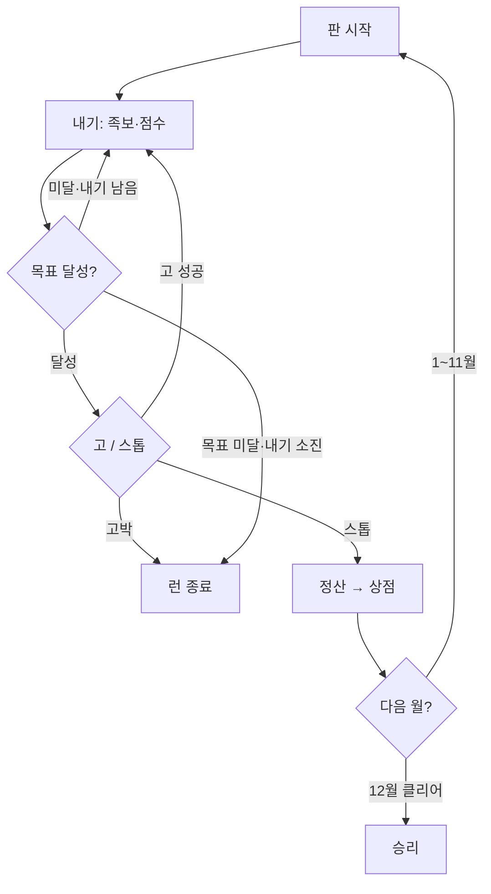

# 십이화 — 기획서

> **한 줄:** 한국 화투 48장으로 하는 1인용 Balatro라이크.  
> 고스톱의 족보·고/스톱·박을, 칩×배수 스코어링·상점·한 해 12판 런에 녹인다.


|         |                                                                          |
| ------- | ------------------------------------------------------------------------ |
| 장르      | 로그라이크 덱빌더 / 카드                                                           |
| 플레이     | 1인 · 웹 (`index.html`)                                                    |
| 한 런     | 1월 → 12월 (12판)                                                           |
| 플레이 URL | [https://hanate.jqklabs.com](https://hanate.jqklabs.com) |
| 관련 문서   | 규칙 요약 → `README.md` · 구현 규칙 → `CLAUDE.md` · 작업 인수인계 → `HANDOFF.md`       |


---

## 1. 왜 이 게임인가


| 가져올 것                  | 출처      |
| ---------------------- | ------- |
| 족보·고/스톱·박·정산의 긴장       | 고스톱     |
| 칩 × 배수, 블라인드 커브, 조커 상점 | Balatro |
| 한 해를 도는 서사·계절감         | 화투 월 체계 |


**플레이 판타지:**  
손패를 짜고 → 한 방 족보로 목표를 넘기고 → 욕심내어 **고**를 외치거나 **스톱**으로 도망치고 → 냥으로 특수패를 사 빌드를 키운다.

---

## 2. 핵심 루프

한 해(런) 안에서 매 달 반복:

1. **판 시작** — 손패 8 · 내기 4 · 버리기 4
2. **내기** — 1~5장 선택 → 족보·점수
3. **목표 달성?**
  - **고** → 다음 문턱으로 계속 (실패 시 고박 = 런 종료)  
  - **스톱** → 정산
4. **정산** — 냥 획득
5. **상점** — 특수패 구매·리롤 → 다음 월
6. **12월 클리어** 시 승리 / 목표 미달·고박 시 런 종료




| 단계  | 플레이어가 하는 일  | 보상 / 리스크                 |
| --- | ----------- | ------------------------ |
| 내기  | 족보·배수 극대화   | 점수                       |
| 고   | 더 높은 문턱에 도전 | 보너스 냥 · 실패 시 **고박=런 종료** |
| 스톱  | 안전하게 정산     | 다음 달로                    |
| 상점  | 특수패 구매·리롤   | 빌드 강화                    |


---


## 3. 런 구조 — 한 해 12달


| 월   | 이름  | 목표    | 비고               |
| --- | --- | ----- | ---------------- |
| 1   | 송학  | 160   | 튜토리얼·조합 오라 · 밤 없음 |
| 2   | 매조  | 240   |                  |
| 3   | 벚꽃  | 320   | **박**            |
| 4   | 흑싸리 | 480   |                  |
| 5   | 난초  | 620   |                  |
| 6   | 모란  | 840   | **박**            |
| 7   | 홍싸리 | 1200  |                  |
| 8   | 공산  | 1800  |                  |
| 9   | 국진  | 2500  | **박**            |
| 10  | 단풍  | 4000  |                  |
| 11  | 오동  | 7000  |                  |
| 12  | 비   | 12000 | **박** · 클리어 시 승리 |


- **낮 → 밤:** 2월부터, 낮에서 **3고 이상** 스톱하면 밤에 도전할 수 있다. 밤 목표는 그달 ×2. 밤 스톱(고 0이어도) → **흑막 주막**. 밤 고박 = 런 종료.
- **박 라운드:** 3 · 6 · 9 · 12월 (직전 상점에서 예고, 12월은 후보 2택 1)

---


## 4. 점수


### 공식

```text
점수 = (코어 카드 칩 합) × 족보 배수 × (특수패 ×배수들)
     + flat(비코어 칩 + 특수패 +점수들)
```

- **족보 기본칩 없음** — 배수가 족보의 전부.
- **코어:** 족보를 만든 카드만 배수를 탄다. 같이 낸 나머지 칩은 flat.
- `Math.floor`는 **최종 점수 1회만**.


### 카드 칩


| 종류  | 칩   |
| --- | --- |
| 광   | 12  |
| 열끗  | 8   |
| 띠   | 6   |
| 쌍피  | 5   |
| 피   | 2   |


쌍피 = 피 2장으로 환산 (피 5장 족보 판정).

### 칩 보정 순서 (바꾸면 밸런스 붕괴)

1. 기본 칩 (더블로 가면 20)
2. **거꾸로** — 기본 칩 ×20 (있으면)
3. **이달의 패** — 현재 월 카드 ×2
4. **외길** — 고른 종류가 아니면 칩 0
5. **박 디버프** — 해당 종류 칩 0 (피박보험·역박 시 무시)

낮/밤 +2 칩은 없다. 밤은 목표·정산 ×2와 흑막 주막용이다.


### 한 판 리소스


| 항목         | 값             |
| ---------- | ------------- |
| 손패         | 8장            |
| 내기         | 4회 (고 1회당 +1) |
| 버리기        | 4회            |
| 한 번에 내는 장수 | 1~5장          |


---


## 5. 족보 (위가 우선)


| 순위  | 족보           | 배수  | 비고              |
| --- | ------------ | --- | --------------- |
| 1   | 오광           | ×12 | 광 5             |
| 2   | 사광           | ×8  | 광 4             |
| 3   | 총통           | ×7  | 같은 달 4장         |
| 4   | 고도리          | ×6  | 2·4·8월 새 열끗 3   |
| 5   | 비고도리         | ×5  | 12월 제비 + 고도리 새 2 |
| 6   | 삼광           | ×5  | 광 3 (비광 없음)     |
| 7   | 비삼광          | ×4  | 광 3 + 비광        |
| 8   | 홍단 / 청단 / 초단 | ×4  | 각 띠 3장          |
| 9   | 병풍           | ×3  | 연속된 달 5개        |
| 10  | 폭탄           | ×3  | 같은 달 3장         |
| 11  | 열끗 셋         | ×3  | 코어 3장, 초과는 flat |
| 12  | 띠 셋          | ×3  | 비단(12월 띠) 제외    |
| 13  | 피 5장         | ×2  | 쌍피=2 환산         |
| 14  | 같은 달 2장      | ×2  |                 |
| 15  | 무조합          | ×1  |                 |


국진(9월 열끗)은 열끗 ↔ 쌍피 전환 가능.

---


## 6. 고 / 스톱

목표를 넘기면 **고** 또는 **스톱**. (12월은 클리어로 직행)


|     | 스톱      | 고                      |
| --- | ------- | ---------------------- |
| 결과  | 정산 → 상점 | 다음 문턱으로 계속             |
| 이득  | 안전      | 내기 +1 · 손패 보충 · 성공 시 냥 |
| 실패  | —       | **고박 = 런 종료**          |


### 문턱 · 보상 (현행)


| 항목     | 공식                        |
| ------ | ------------------------- |
| n고 문턱  | `ceil(기본목표 × (1 + 0.6n))` |
| 성공 보너스 | **n × m** 냥 (m = 현재 월)    |


**밀치기 고:** 선언 시점에 이미 넘긴 문턱은 전부 소급.  
큰 한 방이면 1고 → 3고처럼 점프. 선언 목표는 항상 현재 점수보다 커서, 공짜 연쇄 고는 없다.  
내기 +1은 **선언 1회당 1개** (밀친 단계 수와 무관).

### 설계 의도


| 구간   | 의도                                  |
| ---- | ----------------------------------- |
| 1~3월 | 고를 많이 밀어도 냥이 적음 (`ceil(n×m/2)`) · 문턱도 조금 빡셈 |
| 7월~  | 고 자체가 어려움 → 성공 시 보상은 넉넉해도 됨         |


---


## 7. 경제 · 상점


### 정산 구성


| 항목    | 내용                  |
| ----- | ------------------- |
| 이자    | 보유 6냥당 1냥, **최대 3** |
| 기본    | 일반 2 / 박 라운드 4      |
| 남은 내기 | 1회당 1냥              |
| 고 보너스 | ceil(n × m / 2)     |
| 기타    | 피박보험 정산 +1 등        |


시작 자금 **4냥**. 특수패 슬롯은 **1월 1칸 → 달마다 1칸씩 열려 5월에 5칸**.

### 특수패 출현 (상점 슬롯 1장당)

티어 확률은 고정이 아니라 **그달 등급표** `t=(월−1)/11`. 흑막 주막은 `{월+2}`월 표(상한 14월).


| 티어    | id          | 1월 → 12월 (대략)     | 가격대     |
| ----- | ----------- | ----------------- | ------- |
| 커먼    | `common`    | ~81% → ~20%       | 3–4냥    |
| 레어    | `rare`      | 16% → 36%         | 6–7냥    |
| 에픽    | `epic`      | 2.5% → 39%        | 9–11냥   |
| 레전더리 | `legendary` | 0.4% → 4.7%       | 13–15냥  |
| 암흑    | `dark`      | 흑막만 `(밤 고×0.5+1)%` · 보유 최대 1 | 16–18냥  |


암흑 패는 **흑막 주막**에서만 뜬다. 평소 주막·리롤에는 없다. 이미 암흑을 하나 들고 있으면 더 안 뜬다.

훅: `addChips`(배수 밖 flat) · `addMult`(+배수) · `xMult`(×배수). 광팔이·밑장빼기·피박보험·금줄·고타령은 판/고/정산 훅.

### 특수패 34종


| 이름     | 희귀   | 가격  | 역할                                      |
| ------ | ---- | --- | --------------------------------------- |
| 광팔이    | 커먼   | 3   | 광 낼 때 +1냥 (판당 최대 3) |
| 피장사    | 커먼   | 4   | 피 +4 / 쌍피 +8 (배수 밖) |
| 멍따     | 커먼   | 4   | 멍(열끗)마다 +6 (배수 밖) |
| 쪽집게    | 커먼   | 4   | 쪽(같은 달 2장)이면 +2배수 |
| 쌍피보따리  | 커먼   | 4   | 쌍피마다 +12 (배수 밖) |
| 띠장수    | 커먼   | 4   | 띠마다 +5 (배수 밖) |
| 첫수     | 커먼   | 4   | 그 판 첫 내기 +4배수 |
| 잔손     | 커먼   | 4   | 내기 뒤 손에 남은 장당 +5 (배수 밖) |
| 막판뒤집기  | 커먼   | 4   | 마지막 내기, 남은 버리기 1회당 +2배수 |
| 싹쓸이    | 레어   | 6   | 다섯 장 딱 맞추면 +35 (배수 밖) |
| 고도리꾼   | 레어   | 6   | 족보에 포함되는 고도리 새마다 +3배수 |
| 단골     | 레어   | 7   | 홍/청/초단 또는 띠셋이면 +7배수 |
| 흔들기    | 레어   | 7   | 같은 달 2장↑이면 ×1.5 (흔들기 금지 시 무효) |
| 광모이    | 레어   | 6   | 광마다 +10 (배수 밖, 비광 포함) |
| 피오장    | 레어   | 6   | 피 다섯 장이면 +3배수 |
| 초단꾼    | 레어   | 6   | 족보에 포함되는 초단마다 +2배수 |
| 맞대     | 레어   | 7   | 월 차 6인 쌍(1–7…)이 있으면 +3배수 |
| 금줄     | 레어   | 7   | 박으로 잃은 칩 10점마다 영구 +1배수 (팔면 리셋) |
| 고타령    | 레어   | 7   | 고 2회당 영구 +1배수 (팔면 리셋) |
| 비광우산   | 에픽   | 9   | 12월을 삼광·고도리·초단·띠셋에 쓸 수 있음. 족보에 12월이 있으면 ×2 (무조합 제외) |
| 폭탄     | 에픽   | 10  | 같은 달 3장·총통이면 ×3 |
| 밑장빼기   | 에픽   | 9   | 버리기마다 영구 +10 flat (팔면 리셋) |
| 피박보험   | 에픽   | 9   | 피/광/멍박 무효 + 정산 +1냥 |
| 멍잔치    | 에픽   | 10  | 멍셋(열끗 셋)이면 ×2 |
| 삼광판    | 에픽   | 10  | 족보에 포함되는 광마다 +3배수 (비광 포함) |
| 열두사철   | 레전더리 | 13  | 낸 패의 서로 다른 달 수 × +2배수 |
| 오광소원   | 레전더리 | 14  | 광 3장↑이면 ×2.5 (비광 포함) |
| 명인     | 레전더리 | 15  | 무조합이 아니면 ×2 |
| 더블로 가  | 암흑   | 16  | 버리기 −2. 모든 패 기본 칩 20 (이달 ×2·박 0은 그 위) |
| 거꾸로    | 암흑   | 16  | 족보 배수 역수 (오광 ×1/12). 기본 칩 ×20. 이달 ×2는 유지 |
| 한 수 올인 | 암흑   | 17  | 내기 1회. 그 수 ×4 |
| 역박     | 암흑   | 17  | 피/광/멍박 칩 0 무시. 그 박에서 ×2 |
| 모두가 빈 자리 | 암흑 | 18 | 사는 즉시 보유 패 전부 반값 매각·슬롯 잠김. 이후 (판 직전 보유 수 × 10) 배수 |
| 외길     | 암흑   | 17  | 살 때 광/열끗/띠/피 선택. 그 종류만 칩, ×8. 그 종류 족보면 ×16 |


---


## 8. 박 (보스 디버프)


| 이름     | 효과                            |
| ------ | ----------------------------- |
| 피박     | 피·쌍피 칩 0 (족보 카운트는 유지)         |
| 광박     | 광 칩 0                         |
| 멍박     | 열끗 칩 0                        |
| 흔들기 금지 | 같은 달 2·3장·총통 → 무조합 / 흔들기 패 무효 |
| 비바람    | 버리기 불가                        |
| 안개     | 손패 **2장** 뒷면 (낼 때 공개)         |


3월은 약한 박(피/광/멍) 위주.

---


## 9. UX · 연출 원칙


| 원칙  | 내용                                              |
| --- | ----------------------------------------------- |
| 주스  | 점수 카운트업 · 족보 배너 · 고 연출이 도파민의 핵심                 |
| 용어  | 고스톱·한국 전통 표현 우선 (피박, 밑장빼기, 밤일낮장…)               |
| 모바일 | 一手 조작·터치 영역·팝업 위치 우선                            |
| 온보딩 | 1월 Balatro식 스포트라이트 + 조합 오라(월 3회)                |
| 춘향  | 킥 캐릭터. 조력자형 → **소모 인터랙션(단일 효과)** 으로 개편 검토 (§11) |


---


## 10. 밸런스 철학


| 원칙    | 설명                                      |
| ----- | --------------------------------------- |
| 빡빡하게  | 너프보다 목표·벽을 올리는 쪽을 우선                    |
| 초반 경제 | 고 파밍으로 상점을 박살 내지 않게 (`ceil(n×m/2)` + 후반 문턱 가속)    |
| 종반    | 배수 특수패 + 고 스노우볼 없으면 막히게                 |
| 검증    | `node test/test-game.mjs` (그리디 봇 시뮬레이션) |


대략적 벽 (봇 기준, 300런): 무조커 ~3월(~14%) · 상점 봇(티어 가중 구매) ~6–7월 · 승률 ~0%.

---


## 11. 로드맵


### 검토 중 (우선)


#### A. 손패 + 바닥패

바닥패를 적극 활용하는 방향을 검토 중.


| 항목    | 방향 (초안)                                   |
| ----- | ----------------------------------------- |
| 깔림    | 판 시작 시 바닥패가 **랜덤 장수**로 공개                 |
| 상호작용  | 손패를 바닥패에 **붙여** 사용                        |
| 점수    | 붙인 결과의 **총 점수에 배율을 곱함**                   |
| 아직 미정 | 장수 범위 · 붙이기 조건(같은 달 등) · 배수 곡선 · 바닥 보충 여부 |


> 예전 제안(멍석 = 칩·족보에 합류 / 따닥 ×1.5)과는 **다른 축**.  
> 지금은 “합류”보다 **총점 × 배수** 쪽이 후보. 확정 전 밸런스·연출 프로토타입 필요.


#### B. 춘향 — 조력자 ❌ → 박 보상 진행자 ✅

춘향은 게임의 **킥(개성)** 으로 두되, 만능 조력자·상시 훈수·막걸리 예약은 쓰지 않는다.
역할은 **“3·6·9월 박을 깨면 밑장 세 장을 내미는 사람”** 하나로 고정한다.

| 원칙 | 내용 |
| --- | --- |
| 단일 역할 | 상시 추천·덱 예측·예약 기능 없이 박 클리어 뒤에만 등장 |
| 소모/선택 | 강한 이득과 희생이 묶인 비책 3개 중 하나를 즉시 사용 |
| 내러티브 | 춘향은 효과의 원인이 아니라 금단의 판을 진행하는 인물 |
| 밸런스 | 보관·판매·리롤 불가, 같은 런에서 동일 비책 중복 없음 |

세부 효과는 [한국식 추가 시스템 기획](추가시스템-기획.md)의
**춘향의 밑장** 항목을 기준으로 한다.


### 후보 (스펙 분리)


| 후보      | 한 줄        |
| ------- | ---------- |
| 보너스피    | 덱 성장 소모품   |
| 족보책     | 족보 영구 강화   |
| 뒤집기 찬스  | 도박성 이벤트    |
| 나가리     | 실패 시 목표 이월 |
| 저장/불러오기 | 런 이어하기     |

### 추가 시스템 재설계안

Balatro의 시스템을 화투식으로 번역한 상세안은
**[한국식 추가 시스템 기획](추가시스템-기획.md)**을 따른다.

- **특수패**: 시그니처 14종만 남기고, 보유 칸 한 줄로 읽히는 카드로 거의 개편 (~65종).
  예언·윷·취기·충전 방출처럼 새 HUD가 필요한 패는 보류.
- **점괘·패단장**: 상점의 무작위 점괘를 사면 덱에서 무작위 8장을 펼치고 1~2장을 영구 강화.
- **춘향의 밑장**: 3·6·9월 박 클리어 뒤 강한 대가를 동반한 비책 3택 1.

현재 게임에는 아직 반영되지 않은 **기획안**이다. 구현 전까지 §7의 현행 특수패 규칙과
README의 실제 게임 설명을 기준으로 한다.


---


## 12. 구현 · 기획 시 지킬 것

상세 코드 규칙은 `CLAUDE.md`.

### 엔진 / 코드

- `src/engine/` 은 DOM 금지. 다른 층을 import 하지 않는다.
- 카드 선택은 **uid**.
- 고 목표는 `goThreshold` / `goLevelReached`만 사용.
- 족보·코어 선정은 `detectHandInfo` 한곳.
- 경제 사이드이펙트는 `playSelected()`에서만.


### 바닥패 (도입 시)

- 배수는 **최종 총점 이후**에 곱한다. (칩 보정·족보 배수·특수패와 순서를 문서에 고정)
- 붙이기 조건·장수·보충 규칙을 바꾸면 **봇 시뮬 재실행** 필수.
- 프리뷰(예상 점수)에 바닥 배수·붙일 대상 하이라이트를 반드시 포함.


### 춘향 (개편 시)

- 역할은 **박 클리어 후 밑장 3택 1 진행자** 하나로 고정한다.
- 상시 훈수·덱 예측·막걸리 예약을 함께 되살리지 않는다.
- 비책 하나는 효과와 희생을 한 묶음으로 즉시 처리하고 보관하지 않는다.
- 텍스트·표정·연출로 세계관에 녹이고 기능만 있는 버튼으로 두지 않는다.

---

*마지막 정리: 고 문턱 1~2고 유지·3고부터 가속 · 보너스 `ceil(n×m/2)` · 바닥패(총점×배수) · 춘향의 밑장 3택 1 기획 반영.*

## 결론

앞으로 해야할것들.

발라트로 타로/유령/행성 카드 시스템 추가 고려

### 이 부분은 피그마 빨간 박스 참고

(피그마에 원조 게임 시스템 정리해뒀어요)

1. ~~조커 카드(아이템) 1차 기획~~ → 현행 특수패 22종 구현. HUD 없는 카드로
   **거의 개편** 카탈로그 합의 중(`추가시스템-기획.md` §2.3~2.7). 예언·윷 HUD는 보류.
2. 게임 진행 커브 벨런싱
3. 화투 패 강화 시스템 → **점괘 8종을 통한 패단장 8종** 상세 기획 완료, 구현 검토
4. 바닥 패 시스템을 넣을지/말지
5. 조합 배율 강화하는 것을 어떻게 디자인할지
6. 춘향 → **3·6·9월 박 보상 진행자**로 개편 기획 완료

